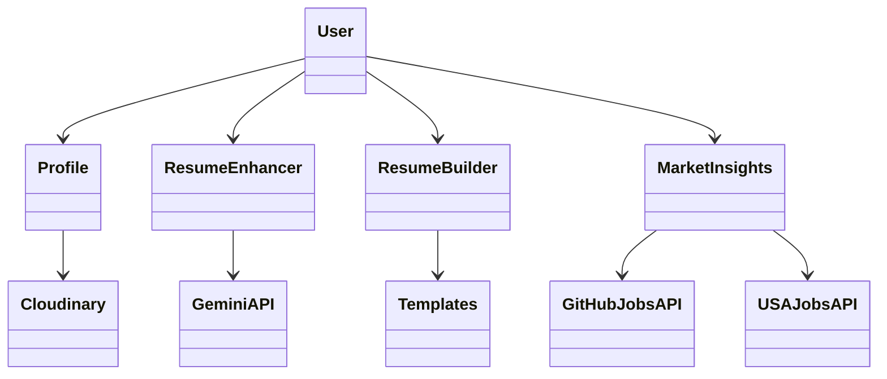

# raise-u.me

## Description

**raise-u.me** is a comprehensive resume-making and enhancing platform designed to help users stand out in the competitive job market. The platform integrates with various APIs and services to offer features like profile creation, resume enhancement, and job market insights.

---

## Tech Stack

-   **Frontend**: Next.js, Next Server
-   **Backend**: Flask (for interacting with Gemini API, Wikipedia, and BeautifulSoup)
-   **Authentication**: Clerk
-   **Storage**: Cloudinary (for resume and media storage)
-   **APIs**:
    -   Gemini API for advanced resume analysis
    -   GitHub Jobs API & USA Jobs for market insights
-   **Libraries**: LangChain Core, BeautifulSoup, Wikipedia lib

---

## Use Cases

1. **Create and Enhance Resumes**: Users can build or enhance their resumes based on specific job descriptions.
2. **Profile Management**: Users can store their professional profiles and media files seamlessly.
3. **Explore Market Trends**: Gain insights into current job trends, popular skills, and more.
4. **Learn from Leaders**: Understand how top tech leaders structure their profiles and skills.
5. **Use Pre-Designed Templates** (in development): Access beautifully designed resume templates.

---

## Actors

1. **User**:

    - Creates and manages profiles
    - Enhances resumes using insights
    - Builds resumes using provided templates
    - Gains market insights

2. **Admin** (future scope):
    - Manages templates
    - Monitors platform usage

---

## Functionalities

1. **Profile Management**:

    - Users can create profiles and upload resumes to Cloudinary.
    - Quick access to previously stored information.

2. **Resume Enhancer**:

    - Uses the Gemini API to analyze user profiles and job descriptions.
    - Provides actionable insights to improve user profiles.

3. **Resume Builder**:

    - Guides users in creating resumes from scratch.
    - Tailors content based on job descriptions using Gemini API.

4. **The Market**:

    - Displays current job market trends.
    - Fetches data from GitHub Jobs API and USA Jobs.

5. **Leader Insights**:

    - Scrapes data on top tech leaders to offer skill and career inspiration.

6. **Templates Page** (in development):
    - Offers a range of professionally designed templates for users to choose from.

---

## Contributors

-   **Tanush Salian**: [@tanush1852](https://github.com/tanush1852)
-   **Shreya Rathod**: [@shreyarathod](https://github.com/shreyarathod)
-   **Satyam Vyas**: [@SatyamVyas04](https://github.com/SatyamVyas04)

---
